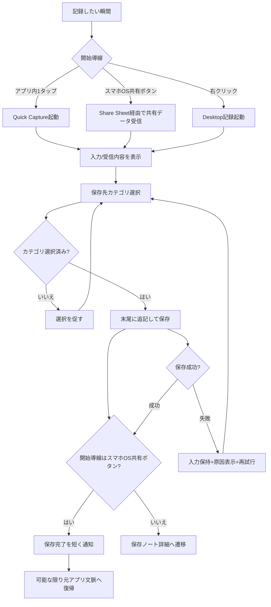
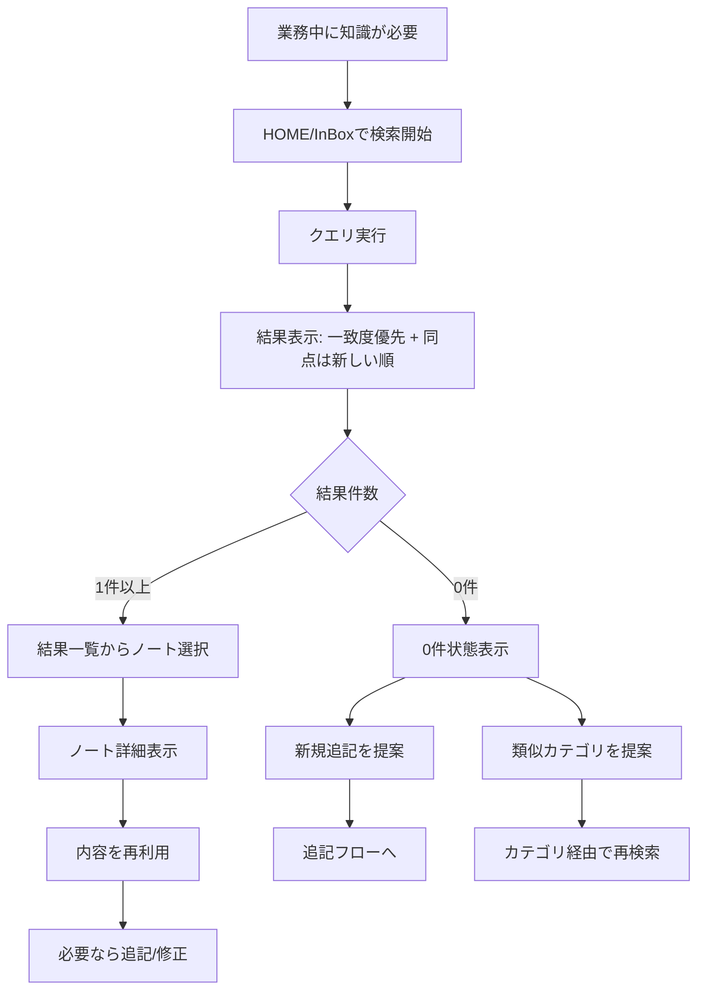
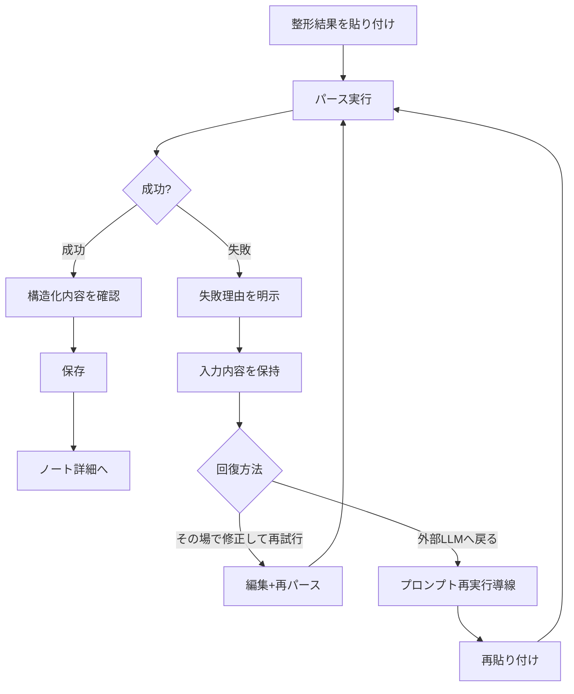

# UX Design Specification MyAkashic

**Author:** Hotake
**Date:** 2026-02-11

---

## Executive Summary

### Project Vision

MyAkashic は、学習中や業務中に得た知識をその場で素早く記録し、単一ノートへの継続追記で資産化し、必要な会話や判断の瞬間に即座に引き出せる体験を実現する。  
MVPでは「入力内容を失わないこと」を最優先に、Mobile → Web → Desktop の順で一貫した記録・整理・再利用導線を成立させる。

### Target Users

Primary User は、学習量が多く業務活用を重視する本人。  
Secondary User は、同様に知識を実務へ転用したい中〜高ITリテラシーのエンジニア/社会人。  
主利用シーンは学習時間と業務中であり、短時間・高頻度の記録と即時検索が求められる。

### Key Design Challenges

- 即時記録導線の統一: 通常入力、共有シート、Desktop右クリックの入口差を吸収し、同等に速い操作感を作る必要がある。  
- 単一ノート追記モデルの可読性: 長期追記で肥大化するノートでも、探索・編集・再利用を迷わず行える情報設計が必要。  
- 信頼性と復旧性の担保: 外部LLM整形や入力途中の失敗時でも、内容消失を防ぎ、必ず復旧できるUXが必要。  
- 実務中10秒再利用の達成: 検索→発見→参照までを短時間で完了させる導線最適化が必要。

### Design Opportunities

- 「会話中に引き出せる」体験の磨き込みにより、汎用ノートとの差別化を明確化できる。  
- 単一ノート追記 + 最上位カテゴリ運用に最適化したUIで、長期知識蓄積の新しい標準体験を作れる。  
- Mobile共有とDesktop右クリックを同じ思想で設計することで、プラットフォーム横断の一貫した記録習慣を作れる。  
- 失敗時の保存保証と再試行導線を強く設計することで、継続率向上に直結する信頼UXを獲得できる。

## Core User Experience

### Defining Experience

MyAkashic のコア体験は、知識を「すぐ入れる → すぐまとめる → すぐ引き出す」を1つの流れで成立させること。  
最重要の反復行動は知識の追記であり、保存と保存先カテゴリ選択の確実性を最優先とする。  
価値の到達点は、実務の文脈で必要な知識を即時に取り出し、知識として定着させられること。

### Platform Strategy

体験の本質は Mobile / Web / Desktop で共通に保つ。  
差分は入力方式のみ（例: 共有導線や右クリック導線）に限定し、記録・整理・検索の概念モデルは統一する。  
オフライン対応はMVPでは最低限（下書き・一時保持）に留める。

### Effortless Interactions

- 知識を簡単に入力できること（最短操作で追記開始）
- 知識を簡単にまとめられること（整形フローの負荷最小化）
- 知識を簡単に引き出せること（短時間で目的情報に到達）
- 保存先カテゴリを迷わず選べること
- 整理済み知識情報をスムーズに取り込めること（再入力コストを減らす）

### Critical Success Moments

- 成功瞬間: 実務中に知識を即時に取り出して活用でき、「身についた」と実感できる瞬間。
- 失敗瞬間: まとめた知識をすぐ探せず、結果として定着・活用につながらない瞬間。
- 破綻条件: 保存失敗や保存先誤りで、記録の信頼が崩れること。

### Experience Principles

- Capture First: 記録開始までの摩擦を最小化する
- Lossless Reliability: 入力内容を失わない設計を最優先する
- Retrieval Under Pressure: 実務中の短時間検索を前提に情報設計する
- Unified Mental Model: プラットフォーム差があっても操作概念は統一する
- Assisted Structuring: 整理済み知識の取り込みを自動化し、手作業を減らす

## Desired Emotional Response

### Primary Emotional Goals

MyAkashic の主要な感情目標は「感動」。  
単なる記録ツールではなく、知識が実務で使える形に変わる瞬間に、ユーザーが価値を強く実感できる体験を目指す。  
その感動は「自分の学びが力になる」という自己効力感へつながることを重視する。

### Emotional Journey Mapping

- 初回利用: 感動（「これは使える」という強い第一印象）
- コア体験中（入力・整理・検索）: 迷わず進める安心感
- タスク完了時: 学びに対する自信と達成感
- 失敗時（整形失敗など）: 不安ではなく、復旧できる安心感
- 再訪時: 再び価値を実感する感動と、継続利用への前向きさ

### Micro-Emotions

- 重視する状態:
  - 自信
  - 安心
  - 達成感
  - 感動
- 回避する状態:
  - 不安
  - フラストレーション
  - 「また探せないかもしれない」という無力感

### Design Implications

- 感動 → 記録内容が整理されて「使える知識」に変わる変化を、視覚的・構造的に明確化する
- 自信 → 検索してすぐ見つかる成功体験を繰り返し発生させる（短い導線、迷わない情報構造）
- 安心 → 失敗時も入力内容を失わない、再試行できる、戻せる導線を標準化する
- 達成感 → 入力完了・整理完了・再利用完了の区切りを明確にし、行動の完了感を提供する

### Emotional Design Principles

- Emotional Payoff First: 操作完了の先に感動と自信が生まれる体験を優先する
- Confidence Through Retrieval: 「見つかる」体験を設計の中心に置く
- Calm Under Failure: 失敗時こそ安心を維持できるUIを必須要件にする
- Progress Feels Real: 記録→整理→活用の進展をユーザーが実感できる形で示す
- No Anxiety by Design: 不安を生む曖昧な状態や失敗の不透明性を排除する

## UX Pattern Analysis & Inspiration

### Inspiring Products Analysis

- Tinder UI
  - 価値: 判断と次アクションが直感的で、迷わず進める。
  - 学び: 1画面で意思決定を完結させる設計は、記録行動の高速化に有効。
- Savespace
  - 価値: 保存開始までの摩擦が非常に小さい。
  - 学び: 入力開始の軽さが継続率に直結する。
- TikTok
  - 価値: 反復行動をスワイプで高速に回せる。
  - 学び: 連続行動を単純ジェスチャ化すると習慣化しやすい。

共通点は「ほぼ1操作で目的達成」「次に何をすべきかが常に明確」である。

### Transferable UX Patterns

- 1タップ追加（最優先）
  - 記録開始を最短化し、記録漏れを減らす。
- 1画面1目的（高優先）
  - 入力・整理・検索の主操作を明確化し、認知負荷を下げる。
- スワイプ操作（限定採用）
  - MVPでは移動系に限定して採用する。
  - 例: 週次レビューの週送り、前後ノート移動、検索ヒット間移動。
- 操作語彙の固定
  - タップ=作成/確定
  - スワイプ=移動/軽い状態切替
  - 長押し=詳細操作

### Anti-Patterns to Avoid

- 複雑な入力フォーム
- 深い階層遷移
- 目的不明の画面遷移
- 重い管理UI
- 不可逆操作をジェスチャに載せる設計
- 一覧内でのネットワーク空間スワイプ移動（縦スクロールと意図が競合）

### Design Inspiration Strategy

- Adopt（採用）
  - 1タップ追加
  - 1画面1目的
  - 次アクションの明示（保存後導線の明確化）
- Adapt（調整）
  - スワイプは移動系のみ採用し、破壊系操作には使わない
  - 削除・統合・上書きは明示ボタンで実行する
  - 破壊系操作は Undo/復旧導線をセットで提供する
- Avoid（回避）
  - 深い階層
  - 複雑入力
  - 一覧にネットワーク操作を混在させる設計
  - 学習コストの高い管理画面型UI

## Design System Foundation

### 1.1 Design System Choice

MyAkashic は Custom Design System を採用する。  
目的は、学習体験にふさわしい独自のトーンを表現しながら、MVPに必要な実装速度を維持すること。  
そのため「最小構成から始める独自設計」を基本方針とする。

### Rationale for Selection

- 差別化要件: 汎用UIではなく、知識の定着と実務活用を後押しする独自体験が必要。
- 優先バランス: 速度と独自性を両立する必要があり、全面作り込みではなく段階構築が適切。
- チーム適合: UI実装スキルが中レベルのため、スコープを絞ったカスタム設計が現実的。
- 品質要件: アクセシビリティを初期から担保する方針と整合する。

### Implementation Approach

- Phase 1: デザイントークン定義（色、タイポグラフィ、余白、角丸、状態）
- Phase 2: コアコンポーネントを優先実装（Button、Input、Search、List Item、Tag、Feedback）
- Phase 3: 体験テンプレート化（Capture、Detail、Review など主要画面パターン）
- Phase 4: プラットフォーム差分を最小ルールで吸収（Mobile/Web/Desktopの一貫性維持）

### Customization Strategy

- 学習にふさわしい色設計:
  - 集中・安心・達成感を軸にした配色体系を定義する
  - 成功・注意・失敗などの状態色を明確化し、不安を生まない情報提示を行う
- 感情設計との連動:
  - 感動・自信・安心を支える視覚トーンを統一する
  - 保存成功、再利用成功、復旧可能性を視覚的に明確化する
- アクセシビリティ優先:
  - 初期段階からコントラスト、フォーカス、可読性、操作領域の基準をデザインルールに組み込む
- 拡張戦略:
  - MVPでは必要最小の部品に限定し、利用データを見て段階的に拡張する

## 2. Core User Experience

### 2.1 Defining Experience

MyAkashic の定義的体験は「1タップで知識追記を開始し、必要な瞬間に即座に引き出せること」。  
特に新規性の核は、共有シート/右クリック経由を含む“即時追記導線”を中心に、思考を止めずに記録行動へ入れる点にある。  
この体験をユーザーが友人に説明するときの一言は、  
「1タップで知識を追記して、必要時にすぐ引き出せる」。

### 2.2 User Mental Model

ユーザーは現状、Notion/Obsidian等で記録はできても、知識の体系化やつながり化を簡単に実行できない。  
そのため、入力の容易さだけでなく「後で使える構造になること」を期待している。  
期待モデルは「記録した瞬間から将来の実務活用に近づく」ことであり、複雑な整理操作は求めていない。

### 2.3 Success Criteria

コア体験が成功している状態は以下で定義する。

- 記録開始まで 1 秒以内（1タップで開始できる）
- 保存完了まで 3 秒以内
- 検索から目的ノート表示まで 10 秒以内
- 保存完了が即時に認知できる
- 検索時に目的知識へ即ヒットする

ユーザー主観としては「保存できた確信」と「探してすぐ見つかる確信」の両方が必要。

### 2.4 Novel UX Patterns

MyAkashic は新規体験中心（Novel-first）を採用する。  
ただし完全新規ジェスチャではなく、既存のOS行動（共有・右クリック）を再解釈して即記録導線に集約する。  
新規性は「新しい操作そのもの」ではなく、「既存操作を最短で知識化に変える統合体験」に置く。

学習導線は初回3ステップの短いガイドを採用する。

1. 1タップで追記を始める  
2. 保存先カテゴリを選ぶ  
3. 後で検索して再利用する

### 2.5 Experience Mechanics

**1. Initiation**
- ユーザーはアプリ内1タップ、または共有シート/右クリックから記録を開始する。
- 入口は複数でも、開始後の体験は共通導線に合流する。

**2. Interaction**
- テキスト入力（または共有テキスト受け取り）後、保存先カテゴリを選択して追記する。
- 必要に応じて整理済み知識の取り込みを行う。

**3. Feedback**
- 保存完了は即時に明示し、成功状態を迷わせない。
- エラー時は入力保持・再試行・復旧導線を同時提示する。

**4. Completion**
- 保存後に次アクション（続けて記録/検索/詳細確認）を明示する。
- 成功の最終到達は「必要時に10秒以内で引き出せる」こと。

## Visual Design Foundation

### Color System

ブランドガイドラインは未定義のため、MyAkashic では `High Contrast Mono + Accent` を採用する。  
基調はモノトーンで情報構造を明確化し、アクセントは `Deep Teal` を使用する。

提案トークン（更新版）:
- `--bg-primary: #FFFFFF`
- `--bg-secondary: #F6F7F9`
- `--surface: #FFFFFF`
- `--text-primary: #101418`
- `--text-secondary: #475467`
- `--border: #D0D5DD`
- `--accent-primary: #0F766E`
- `--accent-pressed: #115E59`
- `--focus-ring: #14B8A6`
- `--success: #0E9F6E`
- `--warning: #B54708`
- `--error: #B42318`

運用方針:
- 主要CTA、フォーカス、進行状態にのみアクセントを使用する
- アクセント乱用を避け、情報理解を優先する
- 感情目標（感動・自信・安心）に合わせ、成功状態の視認性を高く保つ

### Typography System

全体トーンは `Modern`。  
読み込み量が多い前提のため、見出しの強さと本文可読性を両立する。

書体方針:
- Primary: `Noto Sans JP`（本文・UI）
- Secondary: `Space Grotesk`（短い見出し/数値強調、非対応箇所は Primary にフォールバック）

タイプスケール（初期）:
- `h1: 32/40`
- `h2: 24/34`
- `h3: 20/30`
- `body-lg: 18/30`
- `body: 16/28`
- `body-sm: 14/24`
- `caption: 12/20`

可読性ルール:
- 本文は 1行あたり最大 72ch を目安にする
- 長文画面は行間を広めに取り、視線移動負荷を下げる
- モバイル本文の実質最小可読サイズは 16px を維持する

### Spacing & Layout Foundation

レイアウト密度は `Airy`、基準単位は `8px` を採用する。

スペーシング規則:
- 余白スケール: `8 / 16 / 24 / 32 / 40 / 48`
- セクション間は `32` 以上を基本とし、文脈区切りを明確化する
- カード内余白は Mobile `16`、Desktop `24` を基本とする

グリッド方針:
- Mobile: 4 columns
- Tablet: 8 columns
- Desktop: 12 columns

構造ルール:
- 1画面1主目的を維持し、主操作を視線の終点に置く
- 長文ノート表示は横幅を制限し、読み飛ばし可能な見出し構造を必須化する
- 一覧画面では縦スクロール優先、横方向ジェスチャは限定用途でのみ使用する

### Accessibility Considerations

アクセシビリティは初期段階から担保する（後付けにしない）。

必須基準:
- 通常テキストのコントラスト比 `4.5:1` 以上
- 大きい文字・UI要素のコントラスト比 `3:1` 以上
- 主要操作領域は `44x44px` 以上
- キーボードフォーカス可視化を常時有効
- 色のみで状態を伝えない（ラベル/アイコン/文言を併用）
- エラー時は原因と復旧導線を同時提示
- Reduced Motion 設定時はアニメーションを簡略化する

## Design Direction Decision

### Design Directions Explored

`_bmad-output/planning-artifacts/ux-design-directions.html` にて 8方向を比較検討した。  
評価基準は以下とした。

- HOME起点としての分かりやすさ（Inbox中心導線）
- 入力開始までの速さ
- 長文でも読みやすい情報密度
- 主要操作の視認性

特に Direction 1（Capture First Stack）と Direction 5（Focus Composer）が有力候補となった。

### Chosen Direction

**Chosen Direction: Hybrid (Direction 1 + Direction 5)**

- ベース: Direction 1（Inbox中心で全体の見通しを維持）
- 組み込み: Direction 5（入力時の集中UIを採用）
- 目的: HOMEで迷わず探せて、入力時は最短で没入できる体験を両立する

### Design Rationale

- 見やすさ:
  - Direction 1 は情報構造が明快で、HOMEとしての可視性が高い。
- 入力しやすさ:
  - Direction 5 は余計な要素を抑え、1タップ追記の実行性が高い。
- コア体験との整合:
  - 「1タップで追記し、必要時にすぐ引き出す」という定義体験に最も適合する。
- 感情目標との整合:
  - 迷いを減らし、入力完了時の自信と安心を維持しやすい。

### Implementation Approach

- Phase A: HOMEは Direction 1 構造で実装
  - Inbox一覧 + 検索 + 明確なPrimary CTA（追記）
- Phase B: 追記開始後は Direction 5 スタイルへ遷移
  - 入力集中レイアウト、不要要素を最小化
- Phase C: 完了後は HOME に戻し、次アクションを明示
  - 続けて追記 / 検索 / 詳細確認
- Phase D: 計測で検証
  - 記録開始時間、保存完了時間、検索到達時間を追跡し改善する

## User Journey Flows

### Journey A: 即時記録と追記（アプリ内/スマホ共有ボタン/右クリック）

主目的は「思考を止めずに記録開始し、必ずカテゴリ付きで追記を完了すること」。  
スマホOS共有ボタン（Share Sheet）経由の利用頻度を高く想定し、アプリ内導線と同等の成功率を目標にする。

共有導線の評価指標:
- 共有開始から保存完了までの時間
- 共有経由の保存成功率
- 共有経由保存後の再利用率

### Journey B: 検索して10秒以内に再利用

主目的は「業務中の圧力下でも、最短で目的知識へ到達し再利用できること」。

### Journey C: 整形失敗からの回復

主目的は「失敗時に不安を生まず、入力を失わずに回復できること」。

### Journey Patterns

- 複数入口を単一の保存パイプラインへ合流させる
- 保存先カテゴリは毎回明示選択で品質を担保する
- 保存後は次アクションが明確な状態へ遷移する
- 検索0件でも行き止まりにせず、代替行動を同時提示する
- 失敗時は「原因表示 + 入力保持 + 再試行」の三点セットを標準化する
- スマホOS共有ボタン経由では元アプリ文脈を極力壊さない

### Flow Optimization Principles

- Time-to-Action最短化: 記録開始まで1秒以内を維持
- Save Confidence: 保存成功/失敗を即時かつ明確に通知
- Retrieval Under Pressure: 10秒以内到達を妨げる分岐を排除
- No Dead Ends: 0件・失敗時は必ず次の有効行動を提示
- Context Preservation: スマホOS共有ボタン経由では可能な限り元アプリ文脈を維持
- Consistent Recovery: 回復導線は全入口で同一原則に統一

## Component Strategy

### Design System Components

Custom Design System 前提で、基盤コンポーネントは以下を共通化する。  
- Button
- IconButton
- TextInput / TextArea
- SearchInput
- Modal / BottomSheet
- Toast / InlineAlert
- Tag / Chip
- ListItem
- Tabs
- Skeleton / EmptyState

Journey要件からの主なギャップは以下。  
- 1タップ追記の専用起点
- スマホOS共有ボタン受信後の確認UI
- 整形失敗時の回復UI（その場修正中心）

### Custom Components

#### QuickCaptureLauncher
- Purpose: 1タップで追記フローを起動する
- Usage: HOME（Inbox中心）で常時アクセス可能
- Anatomy: Primary CTA、ショートカット表示、現在カテゴリヒント
- States: default, pressed, disabled, loading
- Variants: mobile-fab, web-header, desktop-toolbar
- Accessibility: aria-label「知識を追記」、キーボード実行、44x44px以上
- Content Guidelines: 文言は短く「追記する」に統一
- Interaction Behavior: タップで即入力開始、遅延時はローディング明示

#### ShareIngestPreview
- Purpose: スマホOS共有ボタン経由の受信内容を確認して保存する
- Usage: Share Sheet 受信直後の最初の確認画面
- Anatomy: 受信テキスト、任意コメント欄、カテゴリ選択、保存CTA
- States: default, text-truncated, validation-error, saving, success, failure
- Variants: compact（短文）、long-text（長文）
- Accessibility: 読み上げ順序保証、エラー文言の明示、フォーカス移動管理
- Content Guidelines: 元テキストは原文保持、編集箇所を明確化
- Interaction Behavior: 保存成功時は短い完了通知を出し、可能な限り元アプリ文脈へ復帰
- Additional Spec: 長文は先頭プレビュー + 展開/折りたたみを標準実装する

#### StructuringRecoveryPanel
- Purpose: 整形失敗時に入力を失わず、その場修正で再試行させる
- Usage: 構造化パース失敗時の標準回復UI
- Anatomy: 失敗理由、編集エリア、再試行ボタン、外部LLM戻り導線
- States: default-error, editing, retrying, retry-success, retry-failure
- Variants: inline-panel, full-panel
- Accessibility: エラー理由の読み上げ、再試行結果のライブ通知
- Content Guidelines: 失敗理由は具体的（例: Body欠落）
- Interaction Behavior: 優先操作は「その場修正して再試行」、代替として外部LLM戻りを提供

#### CategoryPickerSheet
- Purpose: 保存前にカテゴリを毎回明示選択させる
- Usage: 追記保存の直前
- Anatomy: BottomSheet、検索欄、最近使ったカテゴリ、カテゴリ一覧、選択確定
- States: default, searching, no-result, selected
- Variants: mobile-bottom-sheet（標準）
- Accessibility: キーボード選択、選択状態の明示、閉じる導線
- Content Guidelines: カテゴリ名は省略しすぎない
- Interaction Behavior: 未選択時は保存不可、選択完了で保存へ進行

### Component Implementation Strategy

- 設計原則: 既存トークン（Deep Teal + Mono）を全コンポーネントで共通利用
- 優先原則: 記録導線を先に完成させる（回答: A）
- 回復原則: 失敗時は入力保持を絶対条件にする
- 一貫性原則: アプリ内/共有/右クリックで保存体験を揃える
- 計測原則: 各コンポーネントに操作計測ポイントを埋め込む

### Implementation Roadmap

- Phase 1（記録導線先行）
  - QuickCaptureLauncher
  - ShareIngestPreview
  - CategoryPickerSheet（最近使ったカテゴリ上位表示を含む）
  - StructuringRecoveryPanel の入力保持基盤（前倒し）

- Phase 2（回復導線）
  - StructuringRecoveryPanel（その場修正優先）

- Phase 3（検索導線強化）
  - SearchResultList（タイトル・カテゴリ表示を固定）
  - ZeroResultAssist（新規追記提案 + 類似カテゴリ提案）

## UX Consistency Patterns

### Button Hierarchy

**When to Use**
- Primary: 1画面1主目的の確定操作（例: 追記保存、再試行）
- Secondary: 補助操作（例: キャンセル、戻る）
- Tertiary/Ghost: 低優先操作（例: 詳細展開、補足導線）
- Destructive: 削除/破棄など不可逆操作

**Visual Design**
- Primaryのみ Deep Teal 塗り（`--accent-primary`）
- Secondaryはアウトライン、Tertiaryは背景なし
- Destructiveは `--error` を使用し、常時目立たせすぎない

**Behavior**
- 1画面にPrimaryは原則1つ
- 非同期処理中はローディング表示 + 多重送信防止
- 押下後の結果（成功/失敗）を必ず提示

**Accessibility**
- タップ領域44x44以上
- フォーカスリング常時可視
- 色以外（アイコン/文言）で意味を補強

**Mobile Considerations**
- Primaryは親指到達域を優先配置
- 共有受信画面では保存CTAを固定位置に保持

### Feedback Patterns

**When to Use**
- Success: 保存完了、再試行成功
- Error: 保存失敗、整形失敗、必須項目不足
- Warning: 破壊操作前、未保存離脱前
- Info: 0件結果、補助案内

**Visual Design**
- Success: `--success`
- Error: `--error`
- Warning: `--warning`
- Info: 中立トーン + 強調は控えめ

**Behavior**
- 成功は短く即時通知（作業継続を阻害しない）
- エラーは「原因 + 次アクション」を同時提示
- 整形失敗時は入力保持を絶対条件にする

**Accessibility**
- ステータスメッセージは読み上げ対応（ライブ領域）
- エラー時は該当入力へフォーカス移動

**Mobile Considerations**
- トーストは重要情報を隠さない位置に表示
- 共有経由では短い成功通知のみで文脈復帰を優先

### Form Patterns

**When to Use**
- 追記入力、共有受信確認、整形結果貼り付け、カテゴリ選択

**Visual Design**
- 長文入力は見出し・補助文で意味を明示
- カテゴリ選択は BottomSheet で一貫
- 必須項目は明確なラベルで先に示す

**Behavior**
- カテゴリ未選択では保存不可
- バリデーションは即時すぎず、送信時に要点をまとめて提示
- 共有受信長文は折りたたみ/展開を標準化

**Accessibility**
- ラベルと入力の関連付け
- エラー理由は具体文で提示
- キーボード操作で完結可能

**Mobile Considerations**
- 入力中のCTA消失を避ける
- キーボード表示時も主要アクションへ到達可能にする

### Navigation Patterns

**When to Use**
- HOME(Inbox)起点、入力集中遷移、検索→詳細遷移、回復導線遷移

**Visual Design**
- HOMEは情報見通し優先（Direction 1）
- 入力時は集中レイアウト（Direction 5）
- 遷移先の目的を見失わないヘッダ文脈を保持

**Behavior**
- 複数入口（アプリ内/共有/右クリック）を共通保存パイプラインへ合流
- 保存後は原則詳細へ、共有経由は可能な限り元文脈へ復帰
- 行き止まり画面を作らない（必ず次アクション提示）

**Accessibility**
- 現在位置を見失わないナビゲーションラベル
- 戻る操作の一貫性維持

**Mobile Considerations**
- 縦スクロール優先、横ジェスチャは限定用途
- スワイプは移動系のみ（破壊操作に使わない）

### Additional Patterns

**Empty / Loading / Search**
- Empty:
  - 0件時は「新規追記提案 + 類似カテゴリ提案」を同時提示
- Loading:
  - 主要待機はSkeletonで構造を先出し
  - 長待機時は状態文言を追加
- Search:
  - 並び順は「一致度優先 + 同点は新しい順」
  - 結果カードの必須情報は「タイトル・カテゴリ」
  - 検索失敗時も再試行導線を明示

**Pattern Integration Rules**
- すべてのパターンで Deep Teal トークンを共通使用
- 1画面1主目的を維持し、Primary行動を1つに絞る
- 回復不能な状態を作らない
- モバイル先行で定義し、Web/Desktopへ展開する

## Responsive Design & Accessibility

### Responsive Strategy

- Desktop（1024px+）は2ペインを基本とし、左にカテゴリ/検索、右に単一ノート本文を配置する。
- Tablet（768-1023px）は簡素化2ペインを採用し、カテゴリ領域は折りたたみ可能にして本文閲覧を優先する。
- Mobile（360-767px）は固定ボトムタブを採用し、追記・検索・カテゴリ到達を最短化する。
- スマホ共有導線は「共有受信確認 → カテゴリ選択 → 保存」を短い直線導線に統一し、完了後は可能な限り元アプリ文脈へ戻る。
- Desktopは右クリック起点の追記導線を提供し、通常入力/共有入力と同じ保存パイプラインに合流させる。

### Breakpoint Strategy

- ブレークポイントはプロダクト要件に合わせた実運用値で固定する。
  - Mobile: 360px - 767px
  - Tablet: 768px - 1023px
  - Desktop: 1024px+
- 実装方針は mobile-first とし、上位ブレークポイントで情報密度を段階的に拡張する。
- すべての主要導線（追記、共有受信、検索、カテゴリ選択）を3帯域で検証対象に含める。

### Accessibility Strategy

- 適合目標は WCAG 2.2 AA 相当とする。
- 色コントラストは本文4.5:1以上を基準にし、色のみで意味を伝えない。
- キーボード操作（Tab/Enter/Escape）で主要導線を完結可能にする。
- スクリーンリーダー向けにラベル、見出し階層、状態変化（保存成功/失敗、再試行結果）を明示する。
- タッチターゲットは最小44x44pxを維持し、フォーカス表示は常時視認可能にする。
- 失敗時は入力保持を絶対条件にし、エラー理由と次アクションを同時提示する。

### Testing Strategy

- 方針は D（A+B+C最小セット同時実施）とし、レスポンシブ/アクセシビリティを同一サイクルで検証する。
- Responsive Testing:
  - 実機検証（スマホ/タブレット）
  - Browser検証（Webは Chrome / Safari を優先）
  - 主要導線での表示崩れ、操作到達性、入力維持を確認
- Accessibility Testing:
  - 自動検査（axe等）
  - キーボード単独操作テスト
  - スクリーンリーダー確認（VoiceOver中心）
  - コントラスト検証と読み上げ順序確認
- 品質ゲート:
  - 保存失敗時に入力が失われない
  - 主要操作が各帯域で完了できる
  - AA相当の重大違反をリリース前にゼロ化する

### Implementation Guidelines

- レイアウトは相対単位（rem/%）中心で実装し、固定幅依存を避ける。
- ナビゲーションは「モバイル固定タブ / タブレット簡素2ペイン / デスクトップ2ペイン」を明示的に分岐実装する。
- 通常入力・共有入力・右クリック入力は共通ドメインモデル（カテゴリ指定 + 末尾追記）で処理する。
- 共有受信画面では原文保持を優先し、長文は折りたたみ/展開を標準化する。
- 保存処理は楽観UIに依存せず、成功/失敗状態を必ず返し、失敗時は再試行可能なまま入力を保持する。
- アクセシビリティ要件（セマンティック構造、フォーカス管理、ARIA、44x44px）をコンポーネント定義に組み込む。
