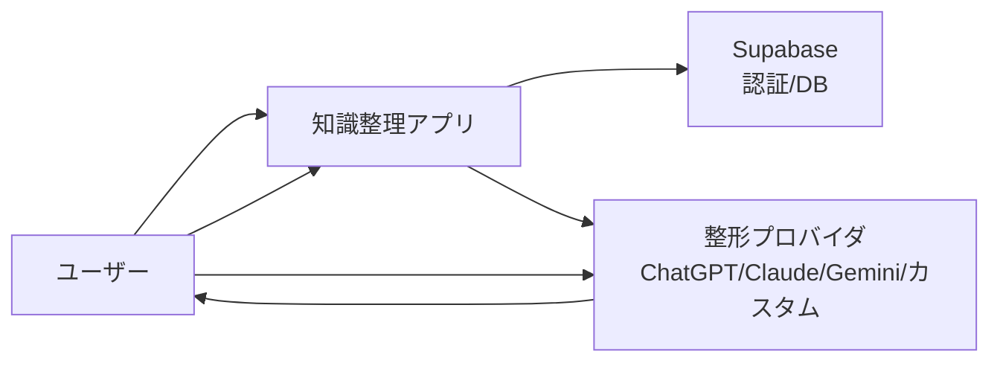
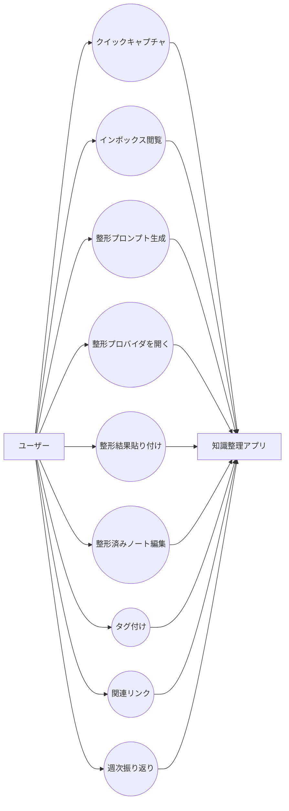
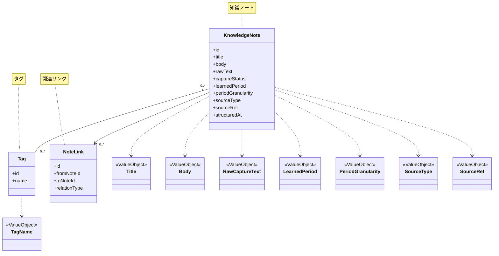
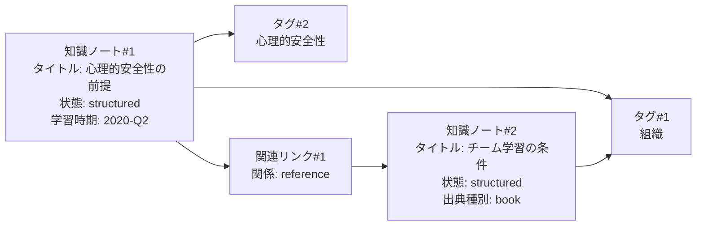

# SUDOモデリング（MVPスコープ / ユビキタス言語ベース）

## 1. ユビキタス言語（MVP必須）
- 知識ノート: 学び/知見の最小単位
- クイックキャプチャ: 雑に入力された未整理の知識
- インボックス: 未整理の知識が集まる場所
- 整形: クイックキャプチャを構造化する行為
- 整形プロンプト: 外部LLMに投げるための整形指示文
- 整形プロバイダ: 整形に使う外部LLM（ChatGPT/Claude/Gemini/カスタム）
- 学習時期: 学びを得た大まかな時期
- タグ: 分類・検索の補助
- 関連リンク: 知識ノート同士の関係
- 振り返り: 過去知識の再提示
- 出典: 本/会社/体験などの来源

## 2. S: システム関連図（System Context）

## 3. U: ユースケース図（Use Case / MVP必須）

## 4. D: ドメインモデル図（Domain Model / MVP必須）

## 5. O: オブジェクト図（Object Diagram / MVP必須）

